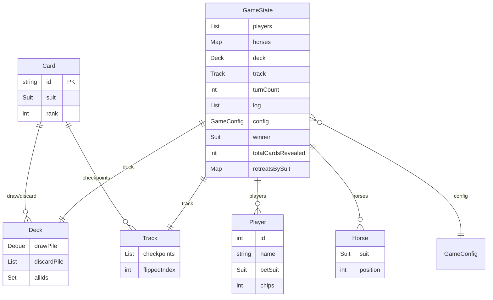

# Carreras de Caballos — Baraja Española

Juego educativo en **Java** con interfaz **JavaFX** y **CSS**, basado en la baraja española (Oros, Copas, Espadas, Bastos).

---

## 1. Planteamiento del problema y requisitos

### Objetivo
Implementar un juego de carreras donde cuatro “caballos” (uno por palo) avanzan según las cartas reveladas de un mazo. La pista tiene N obstáculos (checkpoints); cuando todos los caballos pasan un checkpoint, se voltea la carta y el caballo de ese palo retrocede. Gana el primero que sobrepase el último checkpoint.

### Requisitos funcionales
- **Menú**: Nueva partida, Configuración, Ver reglas, Salir.
- **Configuración**: tamaño de pista N, jugadores 1–8, baraja 40/48, apuestas on/off, modo auto o paso a paso.
- **Partida**: pista y posiciones en pantalla, carta revelada por turno, indicación de checkpoint volteado y retroceso, log de eventos y exportación a `.txt`.
- **Final**: ganador, número de turnos, cartas reveladas, retrocesos por palo, estadísticas de apuestas (fichas).

### Requisitos no funcionales
- Código modular, con tipos claros.
- Sin librerías externas salvo JUnit (tests) y JavaFX (UI).
- Pruebas unitarias (JUnit 5).
- Semilla opcional para `Random` (reproducibilidad).

---

## 2. Análisis del dominio (reglas y estados)

- **Caballos**: 4, uno por palo (As de Oros, Copas, Espadas, Bastos). No son cartas del mazo; son representaciones.
- **Pista**: N casillas (checkpoints). N cartas boca abajo forman la pista; no se rebarajan.
- **Mazo de carrera**: el resto de cartas (40 o 48 menos 4 ases menos N de pista). En cada turno se revela una; el caballo del palo avanza 1.
- **Obstáculo**: cuando **todos** los caballos tienen posición > índice del siguiente checkpoint, se voltea esa carta de pista y el caballo de ese palo retrocede 1 (mínimo 0).
- **Victoria**: primer caballo con posición > N.
- **Rebaraje**: si el mazo se agota, se rebaraja solo el descarte (no la pista) y se sigue.

---

## 3. Modelo de datos y restricciones

### Diagrama ER / clases (Mermaid)



### Entidades

| Entidad   | Atributos / responsabilidad |
|----------|-----------------------------|
| **Card** | `id` (único), `suit`, `rank`. Representación de una carta. |
| **Deck** | `drawPile` (cola de robo), `discardPile`, `allIds` (unicidad). |
| **Horse** | `suit`, `position` (entero ≥ 0). |
| **Track** | `checkpoints` (lista de Card), `flippedIndex` (siguiente a voltear). |
| **Player** | `id`, `name`, `betSuit`, `chips`. |
| **GameState** | Agrega jugadores, caballos, mazo, pista, turno, log, config, ganador, contadores. |
| **GameConfig** | `trackLength`, `numPlayers`, `deckSize` (40/48), `betsEnabled`, `autoMode`. |

### Invariantes / restricciones

- **Unicidad**: no puede haber dos cartas con el mismo `id` en el mazo (controlado por `Deck.allIds`).
- **Ases fuera**: los 4 ases no están en el mazo ni en la pista (se usan solo como caballos).
- **Pista vs mazo**: las N cartas de pista no están en el mazo de carrera.
- **Posición**: `position ∈ [0, N+1]` (0 = salida; > N = meta).
- **flippedIndex**: avanza en orden (0 → 1 → … → N-1) y no retrocede; cada checkpoint se voltea como máximo una vez.
- **Integridad**: caballos creados por palo; deck y track construidos por `DeckFactory` sin solapamiento de cartas.

---

## 4. Estructuras y operadores

| Concepto | Estructura en código | Uso |
|----------|----------------------|-----|
| Checkpoints, log, jugadores | `List` (ArrayList) | Orden, índice (checkpoint i), iteración. |
| Mazo de robo / descarte | `Deque` (ArrayDeque) para draw; `List` para discard | Robar = `pollFirst`; descartar = `add`; rebarajar = mover de discard a draw. |
| Caballos por palo | `Map<Suit, Horse>` (EnumMap) | Acceso O(1) por palo al avanzar/retroceder. |
| Estadísticas por palo | `Map<Suit, Integer>` (EnumMap) | Retrocesos por palo. |
| Palos / config | `Enum` (Suit), objeto `GameConfig` | Valores fijos y configuración. |

**Operadores típicos**
- **Comparación**: `position > nextCheck` para “alcanzó o pasó el checkpoint”.
- **Asignación**: `position += 1` (avance), `position = max(0, position - 1)` (retroceso).
- **Lógicos**: `and` entre “todos los caballos tienen posición > flippedIndex” para decidir volteo.
- **Módulo / índices**: para turnos de jugadores (p. ej. `jugador = turn % numPlayers`) si se usan.

---

## 5. Diseño (módulos y flujo)

```
src/main/java/carrera/
├── Main.java                 # Punto de entrada; lanza JavaFX
├── model/
│   ├── Card.java
│   ├── Deck.java
│   ├── Horse.java
│   ├── Track.java
│   ├── Player.java
│   ├── GameState.java
│   └── Suit.java
├── game/
│   └── GameEngine.java       # Turno, init, checkpoint, victoria
├── util/
│   ├── GameConfig.java
│   └── DeckFactory.java     # Crear baraja y repartir pista/mazo
└── ui/
    ├── GameApplication.java # Stage y escena
    ├── AppController.java   # Navegación menú / config / partida / resultados
    ├── MenuView.java
    ├── ConfigView.java
    ├── RulesView.java
    ├── RaceView.java
    └── ResultsView.java

src/main/resources/
└── styles.css                # Estilos de la aplicación
```

**Flujo**: Menú → (Configuración | Reglas | Nueva partida). Nueva partida → crea `GameState` + `GameEngine` → `RaceView` (turnos hasta victoria o fin de mazo) → `ResultsView` → volver al menú.

---

## 6. Implementación (decisiones clave)

- **Baraja**: 40 (rangos 1–7, 10–12) o 48 (1–12); solo el **palo** determina el movimiento.
- **Reproducibilidad**: `GameEngine(Random(seed))` permite fijar semilla.
- **Rebaraje**: solo el descarte vuelve al mazo; la pista no se toca.
- **Apuestas**: opcional; al final se suman/restan fichas según si el palo apostado ganó.
- **Log**: lista de strings en `GameState`; la UI permite exportar a `carrera_log.txt`.

---

## 7. Pruebas (qué se probó y por qué)

| Prueba | Archivo | Objetivo |
|--------|---------|----------|
| Baraja 40/48 cartas | DeckFactoryTest | Tamaño correcto y 4 ases. |
| Unicidad de cartas | DeckFactoryTest, DeckTest | Sin ids duplicados; Deck rechaza duplicados. |
| Setup mazo/pista | DeckFactoryTest | N en pista, resto en draw; sin solapamiento. |
| Límites de posición | HorseAndTrackTest | position ≥ 0; retreat no baja de 0. |
| Rebarajado | DeckTest | Descarte pasa a draw; draw vacío y discard vacío tras rebarajar. |
| Checkpoint flip | HorseAndTrackTest | flippedIndex avanza; flip solo mientras haya siguiente. |
| Condición de victoria | GameEngineTest | position > N implica ganador; si no, no hay ganador. |
| Un turno | GameEngineTest | Se revela carta y avanza el caballo del palo. |

Ejecutar tests:

```bash
mvn test
```

---

## 8. Cómo ejecutar

### Requisitos
- **JDK 17** (o superior). Debe estar instalado y, si usas el script, **JAVA_HOME** debe apuntar al JDK.

### Opción A: Script `run.bat` (recomendado en Windows)
1. Abre una terminal en la carpeta del proyecto.
2. Asegúrate de tener **JAVA_HOME** definido (por ejemplo `C:\Program Files\Java\jdk-17`).
3. Ejecuta **`run.bat`** (doble clic o `.\run.bat`).
4. La primera vez se descargará Maven Wrapper y las dependencias (JavaFX, etc.); luego se compilará y se abrirá la ventana del juego.

### Opción B: Maven en el PATH
```bash
cd "carrera de caballos"
mvn compile javafx:run
```

### Opción C: VS Code
1. Abre la carpeta del proyecto en VS Code.
2. Instala **Extension Pack for Java** y **Maven for Java**.
3. Deja que el proyecto se importe como Maven (se descargarán dependencias).
4. Ejecutar:
   - **Desde terminal integrada**: `.\run.bat` (con JAVA_HOME definido), o `mvn compile javafx:run` si tienes Maven.
   - **Desde Run and Debug**: usa la configuración **"Carreras de Caballos (JavaFX)"** (incluye module path de JavaFX). Si da error, ejecuta antes `mvn compile` para tener las dependencias en `.m2`.

Desde el menú del juego:
1. **Configuración**: ajustar pista, jugadores, baraja, apuestas, modo auto.
2. **Nueva partida**: iniciar carrera; en modo paso a paso usar “Siguiente turno”; en modo auto la carrera avanza sola.
3. **Exportar log**: durante la partida, guardar el log en `carrera_log.txt`.
4. Al finalizar se muestra ganador, turnos, cartas reveladas, retrocesos por palo y (si hay apuestas) fichas.

### Ejemplo de salida (partida corta, texto conceptual)

```
Carrera iniciada. Pista de 7 checkpoints. Mazo de 31 cartas.
Turno 1: 5♦ → Oros avanza a 1
Turno 2: 2♥ → Copas avanza a 1
...
Checkpoint volteado: 3♦ → Oros retrocede a 2
...
Ganador: Oros
Turnos: 45 | Cartas reveladas: 45 | Retrocesos Oros: 1, Copas: 0, ...
```

---

## Criterios de aceptación

- [x] El juego corre desde la aplicación Java (JavaFX) sin errores.
- [x] Se ve la pista y el avance de los caballos.
- [x] Checkpoints se aplican correctamente (volteo cuando todos pasan).
- [x] No hay cartas duplicadas en la baraja.
- [x] Pruebas unitarias ejecutables con `mvn test`.
- [x] Documentación con modelo de datos, restricciones, estructuras y metodología.
